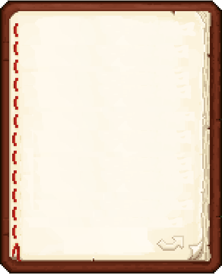

<h1 align="center">minecraft-bookshelf</h1>

This project is a type of note website using these technologies:
- React Typescript
- Scss

All your notes are stored using `localStorage` and a `React useEffect` which makes them completly secure and only readable by you.

<small>from <a href="./src/App.tsx">App.tsx:47</a></small>
```tsx
useEffect((): void => {
    localStorage.setItem("Books", JSON.stringify(books));
}, [books]);
```

you can create your own book and choose to enchant it or not (it's actually just cosmetic):

enchanted: 

not enchanted: 

<h2>Why have I done this project ?</h2>

I've talked about taking notes in university to my sister and she said to me that some persons take notes in minecraft books. I wanted to make something were I don't always need to launch Minecraft, so I made this little project. I wanted also to make something in a week to see if I actually code very slowly.

When I have an idea of project, I code it so I get more and more knowledge in coding which makes me very happy.

<h2>How does it work ?</h2>

To create a books it very easy:
- click on `Add Book`
- Add a name to the book and `Y` or `N` in the next prompt if you want it enchanted or not

to write in it you just have to click on the name of the book, then you will have a page just like in Minecraft:



For getting back, click on the `Done` button, where the note will be saved and put in the `book's localStorage`.

Thanks for using it, it was very fun to do it.